# 🤟 ASL Description2Sign Gloss Translator
### Retrieval-Augmented Generation (RAG) for Linguistic Sign Search

> Translate natural-language descriptions of ASL signs into accurate glosses using vector search + large language models.


---

## 📖 Overview

Identifying ASL signs traditionally requires knowing the gloss name or detailed linguistic parameters.  
This project removes that barrier by letting users simply **describe the sign**.

Using Retrieval-Augmented Generation (RAG), the system searches a curated ASL dataset and uses an LLM to infer the most likely gloss.

---

## 🧠 How It Works

### **1. Dataset (Curated ASL Citizen Subset)**
- ~1,700 manually-verified signs  
- Each annotated with:
  - Handshape  
  - Orientation  
  - Location  
  - Movement  
- Stored in a persistent ChromaDB vector database

### **2. RAG Pipeline**
1. Encode descriptions using **BAAI/bge-large-en-v1.5**
2. Retrieve top-k closest sign candidates from ChromaDB
3. Feed retrieved context + user query into **Qwen2-7B-Instruct**
4. LLM outputs the final gloss (Top-1 or Top-3)

---
## 📊 Project Pipeline

```mermaid
flowchart LR
  %% =========================
  %%  GLOBAL STYLES
  %% =========================
  classDef data      fill:#e8f5e9,stroke:#a5d6a7,color:#1b5e20;
  classDef rag       fill:#e3f2fd,stroke:#64b5f6,color:#0d47a1;
  classDef sft       fill:#f3e5f5,stroke:#ba68c8,color:#4a148c;
  classDef results   fill:#fff3e0,stroke:#ffb74d,color:#e65100;
  classDef deploy    fill:#fff8e1,stroke:#ffd54f,color:#ff6f00;
  classDef neutral   fill:#eceff1,stroke:#b0bec5,color:#263238;
  classDef accent    stroke-dasharray: 5 3;

  %% =========================
  %% 1. DATA CURATION & PREP
  %% =========================
  subgraph S1["1. DATA CURATION & PREPARATION"]
    direction LR
    A1["ASL Citizen Dataset<br/>(Raw Videos)"]
    A2["Manual Verification<br/>& Annotation"]
    A3["Structured Data (JSON)<br/><code>ASL_Description.json</code>"]

    A1 --> A2 --> A3
  end
  class A1,A2,A3 data

  %% =========================
  %% 2. RESEARCH & DEVELOPMENT
  %% =========================
  subgraph S2["2. RESEARCH & DEVELOPMENT (Parallel Paths)"]
    direction LR

    %% ---- Path A: RAG ----
    subgraph RAG["Path A: Retrieval-Augmented Generation (RAG)"]
      direction TB
      VS["Data to Vector Store<br/>(ChromaDB)"]
      EM["Embedding Model<br/>(BAAI/bge-large)"]
      HS["Hybrid Search<br/>(Semantic + Metadata)"]
      CORE["RAG Core Logic<br/>(System Prompt)"]
      LLM["Qwen2-7B-Instruct<br/>(Quantized LLM)"]
      VAL_RAG["Validation Testing<br/>(RAG)"]

      VS --> EM
      HS --> EM
      EM --> CORE
      LLM --> CORE
      CORE --> VAL_RAG
    end

    %% ---- Path B: SFT ----
    subgraph SFT[" Path B: Supervised Fine Tuning"]
      direction TB
      PAD[ ]:::invisible
      DP["Data Preparation<br/>(JSONL Format)"]
      FT["Unsloth/LoRA Fine-Tuning<br/>(Colab T4 GPU)"]
      AW["Adapter Weights<br/>(.safetensors)"]
      VAL_SFT["Validation Testing<br/>(SFT)"]

      DP --> FT --> AW --> VAL_SFT
    end

    %% Inputs from curated data
    A3 --> VS
    A3 --> DP
  end

  class VS,EM,HS,CORE,LLM,VAL_RAG rag
  class DP,FT,AW,VAL_SFT sft

  %% =========================
  %% 3. RESULTS & COMPARISON
  %% =========================
  subgraph S3["3. RESULTS & COMPARISON"]
    direction TB
    AA["Accuracy Analysis<br/>(Memorization vs Generalization)"]
    RAG_LABEL["RAG: High Generalization"]
    SFT_LABEL["SFT: High Memorization"]

    AA --> RAG_LABEL
    AA --> SFT_LABEL
  end

  VAL_RAG --> AA
  VAL_SFT --> AA
  class AA,RAG_LABEL,SFT_LABEL results

  %% =========================
  %% 4. DEPLOYMENT
  %% =========================
  subgraph S4["4. DEPLOYMENT (Hugging Face Space, CPU)"]
    direction LR
    UQ["User Query<br/>(Description)"]
    UI["Gradio UI<br/>(app.py)"]
    MERGE["Merged RAG Logic<br/>& ChromaDB (In-Memory)"]
    LLM_CPU["Qwen2-7B<br/>(GGUF Model on CPU)"]
    OUT["Final Output:<br/>ASL Glosses"]

    UQ --> UI --> MERGE --> LLM_CPU --> OUT
  end

  RAG_LABEL --> MERGE
  class UQ,UI,MERGE,LLM_CPU,OUT deploy
```


## 📂 Repository Structure

This project contains **two separate implementations**, each serving a different purpose:

- **Local development + evaluation**
- **HuggingFace Spaces deployment**

```text
ASL-Description2Sign/
├── HF_Spaces_Deployment/
│   └── ASL-Description2Sign/
│       ├── .gitattributes
│       ├── ASL_Descriptions.json
│       ├── Dockerfile
│       ├── README.md
│       ├── app.py
│       ├── packages.txt
│       ├── requirements.txt
│
├── Local_Pipeline/
│   ├── ASL_Descriptions.json
│   ├── Build_Database.py
│   ├── RAG_Core_2.py
│   ├── main.py
│   ├── test_runs.py
│   └── test_runs_top3.py
```

## 📁 Folder Purpose

### 🔵 `Local Pipeline/`
Contains the **complete local implementation** of the RAG system.  
Use this for:

- Building the vector store  
- Running Qwen2-7B locally (GPU)  
- Evaluating Top-1 / Top-3 accuracy  
- Comparing retrieval performance under different attribute setups  

**Files include:**

- `build_database.py` — Create ChromaDB index  
- `rag_core_2.py` — Core RAG logic  
- `main.py` — CLI interface  
- `test_runs.py` — End-to-end evaluation  
- `test_runs_top3.py` — Top-3 scoring  

---

### 🟣 `HF Spaces Deployment/`
Contains the version **optimized for HuggingFace Spaces**.

Key characteristics:

- Lightweight  
- Uses GGUF quantized Qwen2-7B with `llama.cpp` backend  
- Designed for CPU-only execution  
- Includes a Gradio app for interactive use  

This is the exact version powering the public live demo.

---

## 🌐 Live Demo

Try the ASL Gloss Translator online:

👉 https://huggingface.co/spaces/SudheendraP/ASL-Description2Sign

Download the SEED Videos Dataset:

👉 https://huggingface.co/datasets/SudheendraP/ASL-Citizen-SEED-Videos


---

## 📊 Performance

RAG Accuracy evaluated on ~1,700 signs:

| Attributes Provided | Top-1 Accuracy | Top-3 Accuracy |
|---------------------|----------------|----------------|
| **4 attributes**    | **93.58%**     | **96.87%**     |
| **3 attributes**    | **91.81%**     | **95.85%**     |
| **2 attributes**    | **87.66%**     | **95.91%**     |

---

## 🛠️ Tech Stack

- **Python 3.10+**
- **PyTorch**
- **Transformers (HuggingFace)**
- **Sentence Transformers**
- **Ollama**
- **ChromaDB**
- **Qwen2-7B-Instruct (HF + GGUF)**
- **Gradio**


---

## 🤝 Acknowledgements

ASL Citizen project

HuggingFace ecosystem

BAAI for BGE embeddings

Qwen Team
